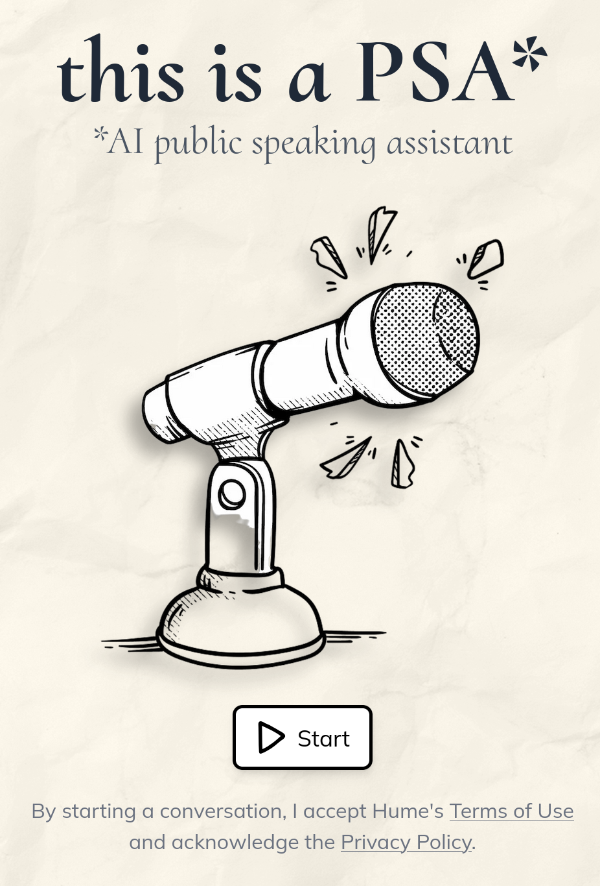

<div align="center">
  
  <h1>EVI Next.js App Router Example</h1>
</div>



## Overview

This project features a sample implementation of Hume's [Empathic Voice Interface](https://hume.docs.buildwithfern.com/docs/empathic-voice-interface-evi/overview) using Hume's React SDK. Here, we have a simple EVI that uses the Next.js App Router.

## Project deployment

Click the button below to deploy this example project with Vercel:

[](https://vercel.com/new/clone?repository-url=https%3A%2F%2Fgithub.com%2Fhumeai%2Fhume-evi-next-js-starter&env=HUME_API_KEY,HUME_CLIENT_SECRET)

Below are the steps to completing deployment:

1. Create a Git Repository for your project.
2. Provide the required environment variables. To get your API key and Client Secret key, log into the portal and visit the [API keys page](https://beta.hume.ai/settings/keys).

## Support

If you have questions, require assistance, or wish to engage in discussions pertaining to this starter template, [please reach out to us on Discord](https://link.hume.ai/discord).

## Feature Implementations

### Voice Commands via Tool Use and Message Emitter

(explaining how a tool is used to pause the assistant and a message emitter is used to resume it)

### Resumability

Resumability is achieved by managing the chat group ID state and updating it upon receiving specific WebSocket messages. Here’s a step-by-step breakdown:

1. **State Initialization**: The `chatGroupId` state is initialized to `undefined`.
  ```js
  // Chat.tsx
  const [chatGroupId, setChatGroupId] = useState<string | undefined>(undefined);
  ```
2. **Handling WebSocket Messages**: When a message is received, the `onMessage` function checks for `chat_metadata` type messages and updates the state with the new chat group ID.
  ```js
  // Chat.tsx
  onMessage={(message) => {
    if (message.type === "chat_metadata") {
      setChatGroupId(message.chat_group_id);
    }
  }}
  ```
3. **State Update and Re-render**: Calling `setChatGroupId` updates the state, causing React to re-render the component with the new chat group ID.
4. **Passing the Updated Value**: The updated `chatGroupId` is passed to the VoiceProvider component via its `resumedChatGroupId` prop. This ensures that the chat session can be resumed with the correct chat group ID whenever a new one is received.
  ```js
  // Chat.tsx
  <VoiceProvider
    resumedChatGroupId={chatGroupId}
    // ... other props
  >
  ```

## Image Attribution
<a href="https://www.freepik.com/free-photo/white-paper-texture_1033849.htm#query=paper%20texture&position=30&from_view=keyword&track=ais_hybrid&uuid=d40bacf0-567c-4d14-bb2b-f7cf692e926b">Image by kues1</a> on Freepik

<a href="https://www.freepik.com/free-vector/hand-drawn-mic-drawing-illustration_82457356.htm#fromView=search&page=1&position=31&uuid=73138e02-1f4e-459e-9b7a-02fa4326c889">Image by freepik</a>

Icons:
- https://www.svgrepo.com/svg/43284/octocat-hand-drawn-logo-outline
- https://www.svgrepo.com/svg/44827/microphone-drawing
- https://www.svgrepo.com/svg/112390/delete-hand-drawn-cross-symbol-outline
- https://www.svgrepo.com/svg/2030/arrow-point-hand-drawn-outline-pointing-to-right-direction
- https://www.svgrepo.com/svg/452661/robot-neutral
- https://www.svgrepo.com/svg/452535/superhero-standing